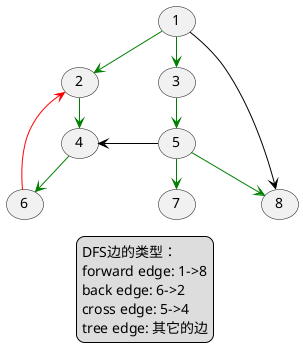
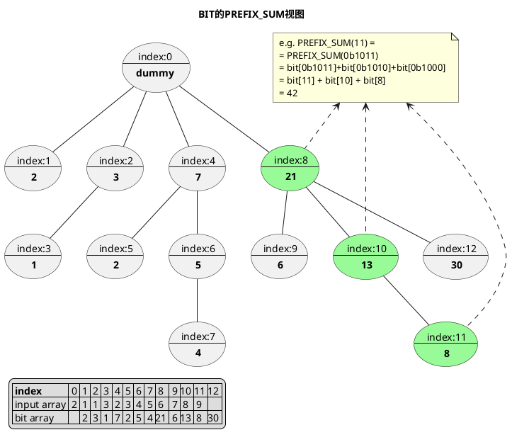
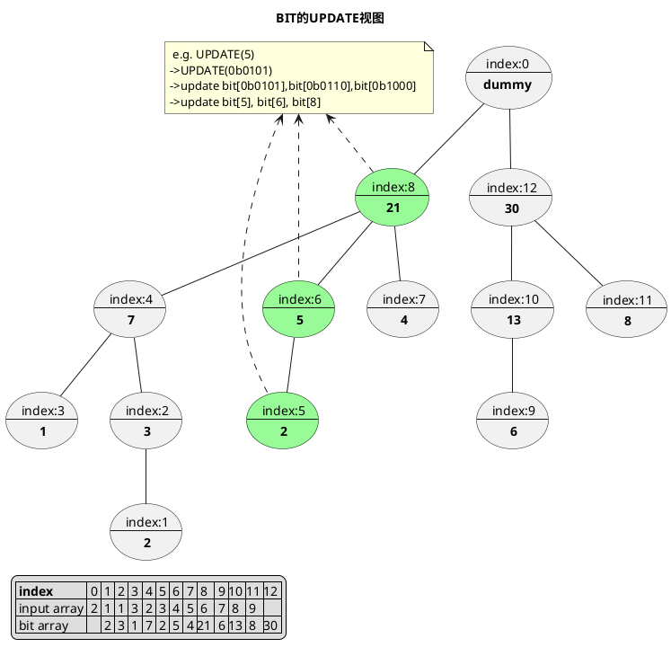

#### 1、BFS广度优先搜索
```
BFS(G, s)
  for each vertex u in V[G]             initialize vertex u 
    color[u] := WHITE
    d[u] := infinity
    p[u] := u
  end for
  color[s] := GRAY
  d[s] := 0
  ENQUEUE(Q, s)                         discover vertex s
  while (Q != Ø)
    u := DEQUEUE(Q)                     examine vertex u 
    for each vertex v in Adj[u]         examine edge (u,v)
      if (color[v] = WHITE)             (u,v) is a tree edge 
        color[v] := GRAY
        d[v] := d[u] + 1
        p[v] := u
        ENQUEUE(Q, v)                   discover vertex v
      else                              (u,v) is a non-tree edge
        if (color[v] = GRAY)
          ...                           (u,v) has a gray target
        else
          ...                           (u,v) has a black target 
    end for
    color[u] := BLACK                   finish vertex u
  end while
  return (d, p)
```
#### 2、DFS深度优先搜索

```
DFS(G)
  for each vertex u in V 
    color[u] := WHITE                    initialize vertex u
    p[u] = u 
  end for
  time := 0
  if there is a starting vertex s
    call DFS-VISIT(G, s)                 start vertex s
  for each vertex u in V 
    if color[u] = WHITE
      call DFS-VISIT(G, u)               start vertex u
  end for
  return (p,d_time,f_time) 

DFS-VISIT(G, u) 
  color[u] := GRAY                       discover vertex u
  d_time[u] := time := time + 1          如有需要，在此做入栈操作
  for each v in Adj[u]                   examine edge (u,v)
    if (color[v] = WHITE)
      p[v] = u                           (u,v) is a tree edge
      call DFS-VISIT(G, v)
    else if (color[v] = GRAY) 
      ...                                (u,v) is a back edge 成环判断！
    else if (color[v] = BLACK) 
      ...                                (u,v) is a cross or forward edge
  end for
  color[u] := BLACK                      finish vertex u
  f_time[u] := time := time + 1          如有需要，在此做出栈操作
```





#### 3、单调栈
单调栈，是内部元素保持单调性的栈。
单调栈可以在线性时间内找出每个元素后面(或前面)第一个更大（或小）的元素。
```
A: 给定的长度为n的数组
stack: 单调栈，初始化为空栈
result: 结果数组，保存A的每个元素后面首个更大元素的下标

NEXT_GREATER_ELEMENT(A):
    for i in range(n):
        while not stack.empty() and A[i] > A[stack.top()]:
            result[stack.pop()] = i
        stack.push(i)
    return result
```

#### 4、BIT树状数组

```
LSB(i)
    return i & (-i)
PREFIX_SUM(bit, i)
    sum := 0
    i := i + 1                  # 注意+1
    while i > 0:
        sum += bit[i]
        i -= LSB(i)
    return sum
UPDATE(bit, i, x)
    i := i + 1                  # 注意+1
    while i < n + 1:            # 注意+1
        bit[i] := bit[i] + x
        i += LSB(i)
CONSTRUCT_BIT(n)
    bit := [0] * (n+1)          # 注意+1  
```






#### 5、UFS并查集
```
INIT(x)
    x.parent := x
    x.size := 1
FIND(x)
    if x.parent != x:
        x.parent := FIND(x.parent)
    return x.parent
UNION(x, y)
    x := FIND(x)
    y := FIND(y)
    if x = y:
        return  # loop detected!
    if x.size < y.size:
        (x, y) := (y, x)
    y.parent := x
    x.size := x.size + y.size
```


#### 6、有向图拓扑排序
 
```
算法一： 入度计数法
G(V, E): the graph
I: indegrees of each node
S: Set of all nodes with indegree == 0  (with no incoming edge)
L: Empty list that will contain the sorted elements 
 
TOPOLOGY_SORT(G):
    while not S.empty():
        u = S.pop()
        L.append(u)
        for v in u.neighbours:
            I[v] := I[v] - 1
            if I[v] == 0:
                S.append(v)
    
    if L.length != V.length:
        return error   (graph has at least one cycle)
    else 
        return L   (a topologically sorted order)
```

```
算法二： DFS

S := set of all nodes with indegree == 0  (with no incoming edge)
L ← Empty list that will contain the sorted nodes

TOPOLOGY_SORT(G)
  for each vertex u in V 
    color[u] := WHITE                    initialize vertex u 
  end for
  for each vertex u in S 
    call DFS-VISIT(G, u)
  end for  

DFS-VISIT(G, u) 
  color[u] := GRAY                       discover vertex u
  for each v in Adj[u]                   examine edge (u,v)
    if (color[v] = WHITE)
      p[v] = u                           (u,v) is a tree edge
      call DFS-VISIT(G, v)
    else if (color[v] = GRAY) 
      stop                               (u,v) is a back edge, cycle detected
    else if (color[v] = BLACK) 
      return                             (u,v) is a cross or forward edge
  end for
  color[u] := BLACK                      finish vertex u
  L.prepend(u)
```


#### 7、有向无环图最长路径
```
# 算法一：拓扑排序法
inv_neighbors := a map from node u to its inbound nodes 
LONGEST_PATH(G):
    V := TOPOLOGY_SORT(G)
    d = [0] * V.length
    for u in V:
        d[u] = max(dists[v] + weight(u, v) for v in u.inv_neighbors)
    return max(d)  # 题目可能要返回max(d)+1
```

```
# 算法二：DFS
INIT():
    dp = [0] * V.length

LONGEST_PATH_TO_NODE(u):
    if dp[u] == 0:
        d = 1
        for v in u.inverse_neighbors:
            d = max(d, LONGEST_PATH_TO_NODE(v) + weight(v, u))
        dp[u] = d
    return dp[u]

LONGEST_PATH(G):
    for u in G.V:
        LONGEST_PATH_TO_NODE(u)
    return max(dp)  # 题目可能要返回max(dp)-1
        
```


#### 8、Dijkstra算法: 带权有向图最短路径
 
```
# G: the graph
# s: source node
# t: target node
# d: distances
# p: parents
# du: distance of node u

DIJKSTRA(G, s, t)
    for each node u in G.nodes:
        p[u] = u
        d[u] = INF
    d[s] = 0
    Q := priority_queue()
    Q.push((d[s], s))                       # heap queue sorted by d[s]
    while not Q.empty():
        du, u = Q.pop()
        if du != d[u]:
            ASSERT du > d[u]                # aother path discovered later but shorter has been popped earlier 
            continue
        if t is not null and u == t:
            break
        for each neighbor v of u:
            alt = d[u] + edge_length(u,v)
            if alt < d[v]:
                d[v] = alt
                p[v] = d
                Q.push((d[v], v))
```

#### 9、欧拉图
```
path := result eulerian path
adjs := adjacent list of the graph
FIND_SOUCR_NODE(G)
    if G is not connected:
        return null
    degrees = indegrees - outdegrees
    if degrees == all zeros:                # an eulerian circuit exists        
        return any node
    if degrees is {-1, 1, 0...}:            # an eulerian path exists
        return node with degree == 0
DFS_VISIT(u)
    while adjs[u] not empty：
        v = adjs[u].pop()                   # remove edge (u, v) from graph
        DFS_VISIT(v)
    path.prepend(u)
FIND_EULERIAN_PATH(G)
    s = FIND_SOURCE_NODE(G)        
    if s is null:                           # no eulerian path exists
        return null 
    DFS_VISIT(s)
    return path
```

#### 10、最小生成树Kruskal算法
```
# G={V,E}： the graph
# ufs: an union-find-set
# mst: the result minimum spanning tree

MST(G):
    E := sorted(E)
    for each edge (u, v) in E:
        if ufs.find(u) != ufs.find(v):
            ufs.union(u, v)
            mst.append((u, v))
        if len(mst) == |V| - 1:
            break
    return mst
```

### 11、有序容器
```
# python
from sortedcontainers import SortedList

sorted_list.add(x): 插入元素x，list会以logN的代价自动保持有序
sorted_list.bisect_left(x): 返回list里有多少个比x小的元素
sorted_list.bisect_right(x): 返回list里有多少个小于等于x的元素
```

```cpp
# c++
namespace pbds = __gnu_pbds;  // 记住这个namespace就好了
using Tree = pbds::tree<
    int,                // key类型
    pbds::null_type,    // 填null_type是set，否则是map      
    std::less<int>,     // 有重复元素的话用std::less_equal，或者把key类型扩展一下保证key唯一
    pbds::rb_tree_tag,  // 一般就填红黑树就好了
    pbds::tree_order_statistics_node_update>;   // 节点跟新策略，填”次序统计“策略

tree.order_of_key(key): 返回key的order，也即tree里有多少个节点小于key
tree.find_by_order(order): 查找第order大的节点   
```